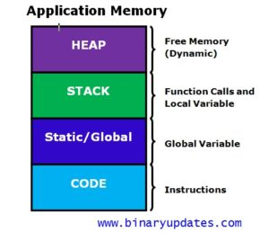
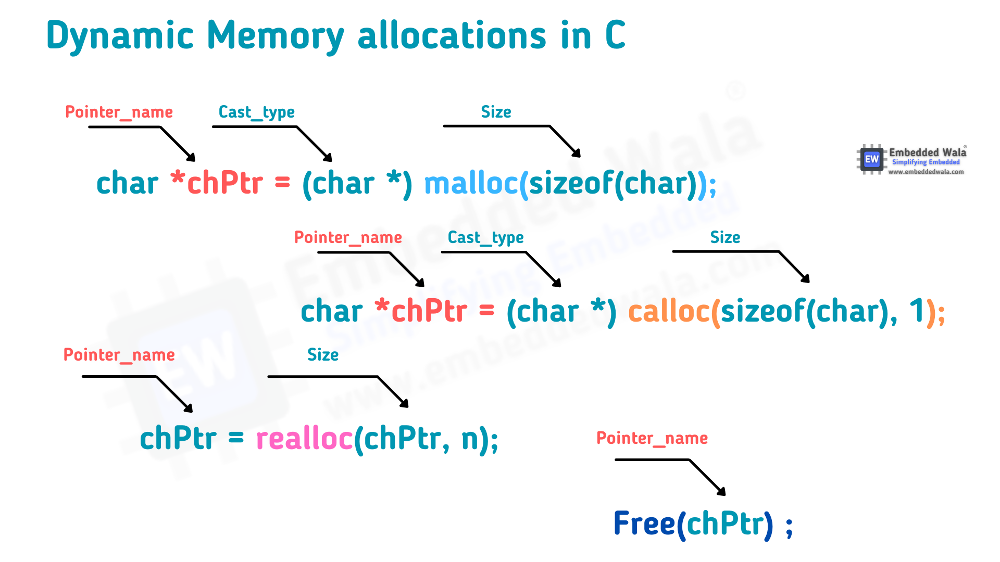

Before jumping to Dynamic memory allocation we need to know about how the memory is used by a program in C.

There are 4 memory segments :-
- **Stack** - it is a region of limited amount of memory that is temporary allocated to a program by the processor and the compiler
    + It operates in LIFO (Last in first out) format. That means that the last piece of data added to the stack is the first one to be removed.
    + The stack is mainly used for storing local variables, function parameters and return addresses.

- **Heap** - It is a region of memory which is used for dynamic memory allocation.
    + this allows more flexible memory usage, as its size is much larger than stack. So the memory can be allocated and freed in any order.
    + The heap is used for variables that need to persist beyond the scope of a function or for large data structures that exceed the stack's capacity.

- **Static/Global**- The static and Global variables are stored in this part..

- **Code** - This part of memory stores the executable code of the program.

### Now back to Dynamic memory allocation…

Dynamic memory allocation refers to the process of dynamically allocating memory during runtime of a program, rather than at compile-time, i.e. static memory allocation.

By default, a limited amount of memory is allocated to a program. The default Memory allocation differs every time. It is decided by the processor and the compiler that how much memory should be allocated to a program.

In C language, Dynamic memory allocation can be done by the following functions which are present in the <stdlib.h> header file.-

- **malloc() -**

    + it stands for “Memory Allocation”.

    + This function is used to dynamically allocate a block of memory of specified size from the heap and returns a pointer to the address of the first byte of the allocated memory in the stack.

    + The memory allocated using malloc() function remains in the heap untill its manually freed with the free() function.

    + In case, if the malloc() function is unable to allocate memory it will return NULL.

- **calloc() -** 

    + It stands for “Clear Allocation”.

    + The calloc() function is similar as the malloc() function, but with a additional feature of initializing the allocated memory block to zero.

    + This function is commonly used when initializing arrays or structures to avoid unpredictable behavior caused by uninitialized values.

- **realloc() -**

    + It stands for “Reallocate”.

    + It is used to resize of memory block that was previously allocated using malloc() or calloc() functions.

    + If there is enough space to expand the block, the realloc() function will adjust the size of the block and return a pointer to the new memory. If there is not enough space, the function may allocate a new block of the requested size, copy the contents of the old block to the new block, and free the old block.

- **free() -**

    + This function is used to deallocate memory that was previously allocated using either malloc(), calloc(), or realloc().

    + If a program attempts to access freed memory, it can result in undefined behavior, including crashes and unexpected results.

Syntax of the above functions…
